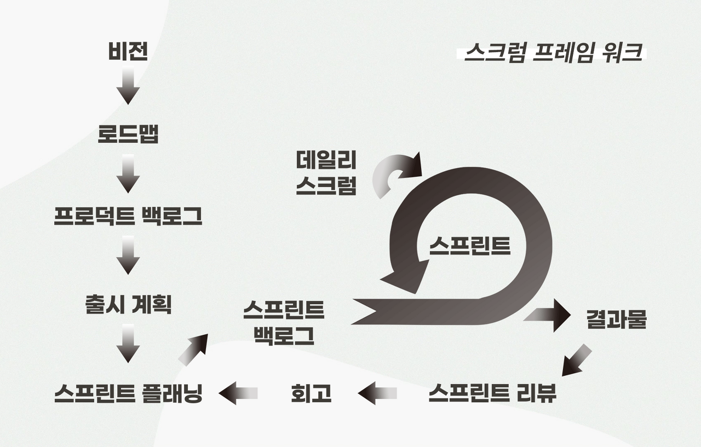

# 스크럼(Scrum)

프로젝트 관리를 위한 상호, 점진적 개발 방법론. 기본적으로 소프트웨어 개발 프로젝트를 위하여 고안되었지만, 소프트웨어 유지보수 팀이나 일반적인 프로젝트/ 프로그램 관리에서도 적용될 수 있다. 애자일 프로세스 중에 가장 인기가 많다.

## 목적

프로젝트를 완료하기 위해 서로 똘똘 뭉쳐 개발하는 것 (모든 방법론의 목적과 비슷하지만 스크럼은 더욱 잘 뭉칠 수 있는 방법을 소개한다.)

## 스크럼의 특성

- 솔루션에 포함할 기능/개선점에 대한 우선 순위를 부여한다.
- 개발 주기는 30일 정도로 조절하고 개발 주기마다 실제 동작할 수 있는 결과를 제공하라.
- 개발 주기마다 적용할 기능이나 개선에 대한 목록을 제공하라.
- 날마다 15분 정도 회의를 가져라.
- 항상 팀 단위로 생각하라.
- 원활한 의사소통을 위하여, 구분 없는 열린 공간을 유지하라.

## 스크럼 로드맵

- 비전 : 3년 ~ 5년 사이 팀의 목표. 이번 프로젝트를 통해 무엇을 이룰 것인지. (3 ~ 5년 동안 이룰 수 있는 계획과 목표)

- 로드맵 : 팀의 1년짜리 계획이자 목표. 1, 2, 3, 4 분기마다 계획과 목표를 세운다. (1년 동안 이룰 수 있는 계획과 목표)

- 프로덕트 백로그 : 쉽게 말하면 해야 할 일의 목록. 각 분기의 계획과 목적을 **이루기 위한** 세부적인 계획과 목표를 세운다. (3개월 동안 이룰 수 있는 계획과 목표)

- 출시 계획(릴리즈 플래닝) : 프로덕트 백로그가 완성되었다면 3개월(한 분기)동안 계획을 어떻게 진행할 것인지 일정을 논의한다. (일주일~한달 정도로 이룰 수 있는 계획과 목표)

> 위 4단계를 계획하는 중간 중간에 개발 요구사항(고객, 팀, 관계자들로부터)을 받아서 작성한다.

- 스프린트 플래닝 : 스프린트란 짧은 거리를 전력질주하는 것. 스크럼에서 스프린트은 최소 1주일에서 최대 1달이라는 시간동안 우리 팀이 집중해서 일하는 기간을 뜻한다. 즉, 스프린트 플래닝은 집중해서 일하는 기간동안 어떻게 일을 해 나갈지에 대해 모든 팀원이 모여 스프린트 첫날에 업무 계획을 공유하고 소통하는 것을 말한다.

- 스프린트 백로그 : 스프린트 중 우리가 해야 할 일의 목록.

- 스프린트 : 위에서 계획한 일들을 실행에 옮긴다. 단, 이렇게 달리는 과정에서 매일 해야하는 것은 '데일리 스크럼' 이다.

> '데일리 스크럼'이란 하루 시작 전 모든 팀원들이 모여서 현재 진행상황과 문제를 서로 공유하는 자리이다. (약 15분 정도 진행한다.)

'데일리 스크럼'은 간단하게 이러한 내용을 공유하는 것이 목적이기에, 일어서서 진행하기도 하며 이를 '데일리 스탠드업'이라고 부른다.

- 결과물(프로덕트 인크리먼트) : 스프린트가 잘 마무리되면 우리가 목표했던 결과물이 나오는데 이를 프로덱트 인크리먼트라고 한다.

- 스프린트 리뷰 : 결과물을 가지고 스프린트 리뷰를 진행한다. 스프린트를 진행한 우리 팀원들 뿐만 아니라, 실제 고객이나 혹의 회사의 의사결정권자, 이번 프로젝트에 관여된 관계자들이 함께 모여, 결과물을 살펴보고 다음 스프린트는 어떻게 효율적으로 진행할지 이야기한다.

- 회고 : 한 번의 스프린트 리뷰가 끝나고 나면 우리 팀원들끼리만 모여, 우리가 이번 스프린트에선 어떻게 일 했는지. 어떻게 하면 더 잘 일할 수 있을지에 대해 이야기하는 시간. **서로 존중하고 배려하면서도, 솔직하게 소통하는 것이 핵심.**

> 스프린트 단계에서 발생하는 문제들과 잘못된 부분을 코칭하여 해결하는 '스크럼 마스터'라는 역활이 있다.

- 회고가 끝난 뒤에는 새로운 스프린트를 시작한다. 이런 사이클을 반복하면서 프로젝트의 비전과 로드맵을 실현하는 것이 바로 '스크럼'이다.

> 참고 사이트

- https://ko.wikipedia.org/wiki/%EC%8A%A4%ED%81%AC%EB%9F%BC_(%EC%95%A0%EC%9E%90%EC%9D%BC_%EA%B0%9C%EB%B0%9C_%ED%94%84%EB%A1%9C%EC%84%B8%EC%8A%A4)

- https://brunch.co.kr/@workingus/31
