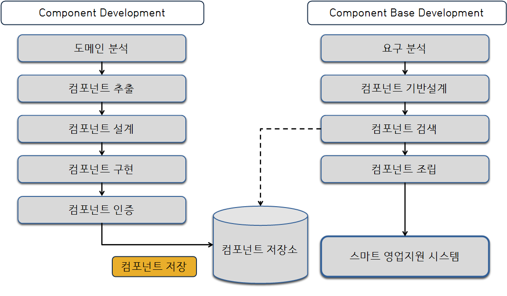

# CBD 개발방법론이란?

사용 가능한 컴포넌트의 개발 또는 상용 컴포넌트를 조합해 애플리케이션 개발 생산성과 품질을 높이고 시스템 유지보수 비용을 최소화할 수 있는 개발 방법 프로세스

# CBD 개발 방법론 구조(개념도)

CBD 개발 방법론은 크게 컴포넌트를 개발하는 CD(Component Development) 단계와 개발된 컴포넌트를 사용해서 개발을 진행하는 CBD(Component Base Development) 단계로 나눌 수 있다. CD 단계에서는 도메인을 분석해 컴포넌트 대상 업무를 선별하고 컴포넌트를 개발해 저장소에 입력한다. CBD 단계에서는 요구 분석을 통해 컴포넌트 기반으로 설계하고 필요한 컴포넌트를 저장소에서 찾아서 조립하는 방식으로 프로그램 개발을 진행한다. 만일 필요한 컴포넌트가 저장소에 없다면 CD 단계로 돌아가서 컴포넌트를 개발하고 이를 사용해 개발을 계속 진행한다.
