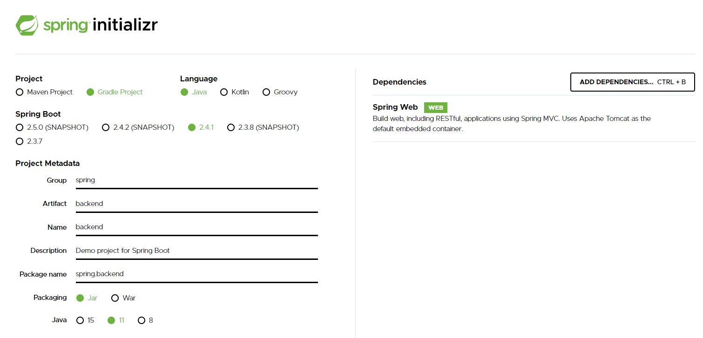

# BackEnd 초기 설정

https://start.spring.io/ 를 통해 server 초기 설정



### redirect

```java
 @PostMapping("/api/members/create")
    public String MemberCreate(Member member) {
        memberService.join(member);

        return "redirect:http://localhost:3000";
    }
```

다시 홈 화면으로 보낼 경우, "/"가 아닌 redirect: [redirectURL]로 정확하게 보내준다. [(참고)](https://stackoverflow.com/questions/9311940/redirect-to-dynamic-url-in-spring-mvc)

- 리액트에서는 바람직하지 못하다.(새로고침을 하기에) => 다른 방법을 찾아보자.

### Java 8 Optional

자바로 개발하다보면 NullPointerException(NPE)라는 에러는 많이 보게 된다. 이를 해결하는 방법은 조건문도 있지만 null값이 나오는 구간마다 사용하면 가독성이 떨어지기에 Optional을 사용하여 가독성을 높인다.

- Optional 메소드
  - empty() : 빈 Optional 객체 생성
  - of(value) : value 값이 null이 아닌 경우에만 반환
  - ofNullable(value) : value값이 null인지 아닌지 확실하지 않을 경우에 사용
  - isPresent() : 현재 값이 있다면 true, 없다면 false를 반환한다.
  - [[추가적인 메소드]](https://docs.oracle.com/javase/8/docs/api/java/util/Optional.html)
